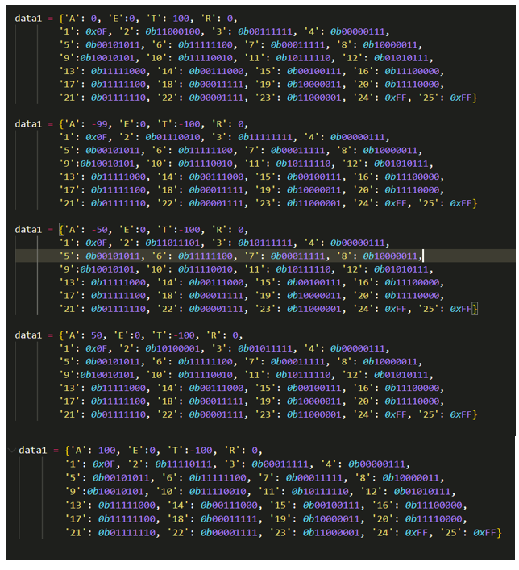

# Gremsy H16 gimbal

If Gremsy H16 gimbal must be used as drone's gimbal, this section provides useful information to understand the classes ``GimbalGremsyH16`` and ``SBUSEncoder`` responsible to control gimbal's orientation (yaw, pitch, roll). Information about the classes is provided in the html document containing information about all the API developed.

It is required a TTL-to-USB "bridge" to connect the host computer with the sbus port of the gimbal. There are different manufacturer specifications for the SBUS protocol. For this one, an inverter of the Tx Uart signal is required (due to this sbus specification, it is required to invert the normal idle voltage level in UART communication; more on this is found later in this section).

The data field of the sbus protocol is the Remote Control (RC) control value used by most of the RC vendors (i.e. FrSky, flysky, ...): a value in the range [-100, 100] that is equivalent to the angular speed at which the gimbal will move. Another data field controls which axis (yaw, pitch or roll) is moved using either the throttle, aileron, rudder or elevation channels of a conventional RC. With this being said, the angle (either yaw, pitch or roll) is controlled then by the RC control value (equivalent to speed) and the time the sbus protocol will hold that value.

Due to the fact that the RC control value is not actually a speed value, a characterization of the angle (yaw, pitch or roll) dependence on this RC control value and time, is needed. 

As it is not possible to access Gremsy gimbal's controller (and thus its IMU) an external IMU is required to read gimbal's angle for the characterization. Alternatively, the characterization can be done as described in what follows without the need of an external IMU. 

## Characterization of Gremsy H16 angle dependece on the RC control value and the time holding it

NOTE: *this characterization was designed before the arrival of an external IMU. The angle characterization can be done in an easier manner by using the external IMU, a cheap host MCU (i.e. a Raspberry Pi Pico running CircuitPython with an implemented function reading IMU values is available) and the methods* ``start_imu_thread``, ``receive_imu_data``, ``stop_thread_imu`` of the class ``GimbalGremsyH16`` (described in the API html document).

In the following Figure it is shown an illustration of the measurement setup from a top view. The point where all lines collide is the beginning of the laser beam. The ticks that appear in the wall are marks of 10 cm. 

<figure markdown="span">
  { width="400" }
  <figcaption>Illustration of lines between the laser beam at the gimbal and the regular ticks at the wall</figcaption>
</figure>

For each of the triangles in the previous Figure, we can obtain the angles $\alpha, \beta, \gamma$ defined in Figure [Angle distances](assets/Angles%20and%20distances%20definitions.PNG). The distances $a_{i}, a_{i+1}, b_{i}, \: i=1,\;...,\;12$, are known and are shown in the following Table. 

| No.     | $a_{i}$ [m] | $a_{i+1}$ [m] | $b_{i}$ [m] | $\alpha_{i}$ [deg] | $\beta_{i}$ [deg] | $\gamma_{i}$ [deg] |
| :-------: | :--------: | :--------: | :--------: | :--------: | :--------: | :--------: |
| 1 | 1.985 | 1.955 | 0.1 | 2.77 | 71.16 | 106.06 |
| 2 | 1.955 | 1.93 | 0.1 | 2.85 | 74.09 | 103.04 |
| 3 | 1.93 | 1.91 | 0.1 | 2.92 | 77 | 100.07 |
| 4 | 1.91 | 1.895 | 0.1 | 2.97 | 79.88 | 97.13 |
| 5 | 1.895 | 1.884 | 0.1 | 3.01 | 82.17 | 94.8 |
| 6 | 1.884 | 1.878 | 0.1 | 3.04 | 85.04 | 91.91 |
| 7 | 1.878 | 1.879 | 0.1 | 3.05 | 89.04 | 87.9 |
| 8 | 1.879 | 1.882 | 0.1 | 3.04 | 90.19 | 86.75 |
| 9 | 1.882 | 1.892 | 0.1 | 3.02 | 94.22 | 82.75 |
| 10 | 1.892 | 1.906 | 0.1 | 2.98 | 96.55 | 80.46 |
| 11 | 1.906 | 1.926 | 0.1 | 2.93 | 100.06 | 77 |
| 12 | 1.926 | 1.949 | 0.1 | 2.87 | 101.06 | 75.26 |

From those distances the angles are obtained by solving the following 3 equations.

$$
\cos(\alpha_{i}) = \frac{a_{i}^2 + a_{i+1}^2 - b_{i}^2}{2a_{i} a_{i+1}}
$$

$$
\cos(\beta_{i}) = \frac{b_{i}^2 + a_{i}^2 - a_{i+1}^2}{2b_{i} a_{i}}
$$

$$
\cos(\gamma_{i}) = \frac{b_{i}^2 + a_{i+1}^2 - a_{i}^2}{2b_{i} a_{i+1}}
$$

<figure markdown="span">
  { width="400" }
  <figcaption>Zoom-in at one of the "triangles" defined in the previous Figure</figcaption>
</figure>

## SBUS Encoder

The SBUS encoder at the host computer mimics the behaviour of a Remote Controller (RC) transmitter. Specifically, it mimics the behaviour of the transmitter for which a X8R FrSky receiver is paired.

The X8R FrsKy frame is encoded in the SBUS protocol. It is a serial protocol that uses regular UART communication, where a packet is composed by a start bit in '1', 2 stop bit in '0', even parity (meaning '1' when even number of '1's in data) and 8 bits of data. High voltage is '1' and low voltage is '0'. The RC values of the channels, for instance throttle, rudder, elevation and aileron  (besides other possible channels) are encoded into 11 bits (meaning more than 1 UART packet). 

No receivers besides the FrSky were used, but it is highly probable that those 11 bits are used in different manners by different manufacturers (and even within the same manufacturer, there might be used differently for different receivers). Some might use MSB or LSB. And each of them might map in a different way the channel values from the RC TX (throttle, rudder, elevation and aileron channel values lie within the interval [-100, 100] in the RC TX) to the actual 11 bit representation (i.e.: is the -100 value a 0 in 16-bit unsigned integer representation or is it a -100 in 16-bit signed integer representation or is it any other value they use for specific reasons?). 

Since the range of unsigned integers one can get with 11 bits starts in 0 and ends in 2047, an intuitive encoding of the [-100, 100] would be using 0 for -100 and 2047 for 100. However, it has been seen in forums of different receivers that not always the manufacturer is interested in using the full [0, 2047] scale for the 11 bits. 

Furthermore, the mapping between the other RC channel values lying within (-100, 100) to the 11 bit representation might not be linear. 

The 11 bit were measured with an oscilloscope at the X8R receiver for the case when the RC TX was sending a -99, -50, 0, 50, 100. Figure \ref{fig:x8r_osc_values} shows the 8-bit data values for each of the 25 channels sent by the RC TX.

<figure markdown="span">
  { width="400" }
  <figcaption>Python dictionaries for different values of a given channel at the RC TX. 'A' refers to the Aileron channel, 'E' for Elevation, 'T' for Throttle and 'R' for Rudder. In this case the channel that was changed at the RC TX was 'A', but the same procedure applies to either 'E', 'R' or 'T'. The numbers '1', '2', ... '25' are the 22 channels that conform a SBUS frame, excluding the SYNC ('1') and 2 STOP packets ('24, '25)</figcaption>
</figure>

## Drifting

When the gimbal is controlled remotely (Lock Mode) there is a drift towards the right w.r.t to the reference along the azimuth axis. Rudder (azimuth) positive values make the gimbal move to the left, while negative values make the gimbal move to the right.

**The value of the drifting towards the right is $\frac{10}{30} \frac{cm}{s}$**.

The SBUS encoder at the host computer is periodically (periodicity has been test for the interval 9-20ms) sending a frame to the gimbal with the channel values. The channels that are of our interest are rudder (or the RC channel -throttle, rudder, elevation, aileron- used for azimuth) and the elevation (or the RC channel -throttle, rudder, elevation, aileron- used for elevation). 

### Counter the right drift by setting a non-zero rudder (azimuth) for gimbal rest

When the gimbal stops moving, by the default, the frame sent periodically has a 0 in the elevation and azimuth channels. This makes sense, since the 0 in both channels means that the gimbal should not move. However, since there is a drift towards the right in the azimuth axis, we can counter it by instead of sending a 0, send a value (such that the gimbal moves towards the left) when the gimbal is supposed to rest. 

The lowest value for rudder (azimuth) experimentally found to counter the drifting towards the right in azimuth is ``LOW_SPEED_COUNTER = 8.74601226993865933``. By lowest it is meant the following:

If you take the rudder value ``NOT_COUNTER_SPEED = 8.74601226993865932``, any rudder value ``SPEED <= NOT_COUNTER_SPEED`` will not counter the drifting towards the right. This means for any of those values, the gimbal will still have a drift of $\frac{10}{30}\frac{cm}{s}$ to the right. 

However, when ``LOW_SPEED_COUNTER`` is used as the value periodically sent for the rudder (azimuth) channel, what happens is that the gimbal starts to drift to the left.

**With ``LOW_SPEED_COUNTER`` used as the value for the rudder channel when we want the gimbal to stay at its position, the drifting is about $\frac{10}{75}\frac{cm}{s}$ to the LEFT**.

This means that the actual rudder value ``REAL_COUNTER_SPEED`` that counters the drifting to the right lies within ``NOT_COUNTER_SPEED < REAL_COUNTER_SPEED < LOW_SPEED_COUNTER``.

However, the value ``REAL_COUNTER_SPEED`` might be an irrational number, meaning it requires infinite decimals for representation. Since that is not possible, the counter for the drifting has to be achieved in another way.

### Counter drift by toggling rudder value for gimbal rest

It is possible to reduce further the drift by considering the following.

Given a time $\Delta t$ that can be interpreted as an interval of time during which the gimbal drifts, the gimbal will move an amount of $\Delta x$ in millimeters

$$
\Delta x = pv_{1} \Delta t + q v_{2} \Delta t    
$$

in the interval $T$ in seconds

$$
T = p \Delta t + q \Delta t  
$$

where $p, q$ are integers, $v_{1} = \frac{100}{75} \frac{mm}{s}$ is the drifting velocity after setting a non-zero rudder for gimbal rest, and $v_{2} = - \frac{100}{30} \frac{mm}{s}$ is the drifting velocity when a zero-rudder value is set for gimbal rest.

As a consequence of this, the resulting drifting velocity $v_{DRIFT}$ in millimeters per second, would be

$$
v_{DRIFT} = \frac{\Delta x}{T} = \frac{pv_{1} \Delta t + qv_{2} \Delta t}{p \Delta t + q \Delta t} = \frac{pv_{1} + qv_{2}}{p+q}
$$

We can find values for $p$ and $q$ such that $\Delta t = 0$. Such values satisfy the relationship:

$$
pv_{1} = - qv_{2} \: \: \:  \rightarrow  \: \: \: 2p = 5q \rightarrow p = \frac{5}{2} q
$$

Since $p, q$ are integers values that represent the number of $\Delta t$ times we move with speed $v_{1}, v_{2}$ respectively, we choose $q$, such that $p$ is an integer. 

**For example, choosing $q = 2$ gives $p = 5$, and what this means is that for each 7$\Delta t$ periods of time, the rudder value for when the gimbal rests, will be \texttt{LOW\_SPEED\_COUNTER} during 5$\Delta t$ seconds (corresponding to a drift towards the left of $v_{1}$), and 0 during 2$\Delta t$ seconds (corresponding to a drift towards the right of $v_{2}$**.

Now, $\Delta t$ can be any value, but, as for the SBUS protocol there is the need to send a frame each given time (i.e. 10 ms), this period we set to periodically send that frame corresponds to $\Delta t$. 

However, this last choice requires further revision of previous equations. It will happen that since this is implemented in software, the period $\Delta t$ is not always the same. We can revisit the equations by considering that, if the period jitter is not big (is a fraction of the real assumed period), $\Delta t$ for any of the two speeds is slightly different:

$$
\Delta x = pv_{1} \Delta t + q v_{2} k \Delta t 
$$

where $0<k<2$. A value of $k = 0.1$ means that the actual period during which the velocity was $v_{2}$ was 0.1 times the period during which velocity was $v_{1}$, and a value of $k = 1.9$ means that the actual period during which the velocity was $v_{2}$ was 90$\%$ longer than the period during which velocity was $v_{1}$.

In practice, it is hard to have control over this period mismatch. What this means is that the value of $k$ can't be predicted easily, and will vary between a value lower than 1 and a value higher than 1 (but lower to 2).