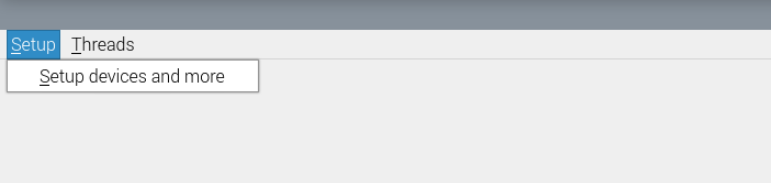
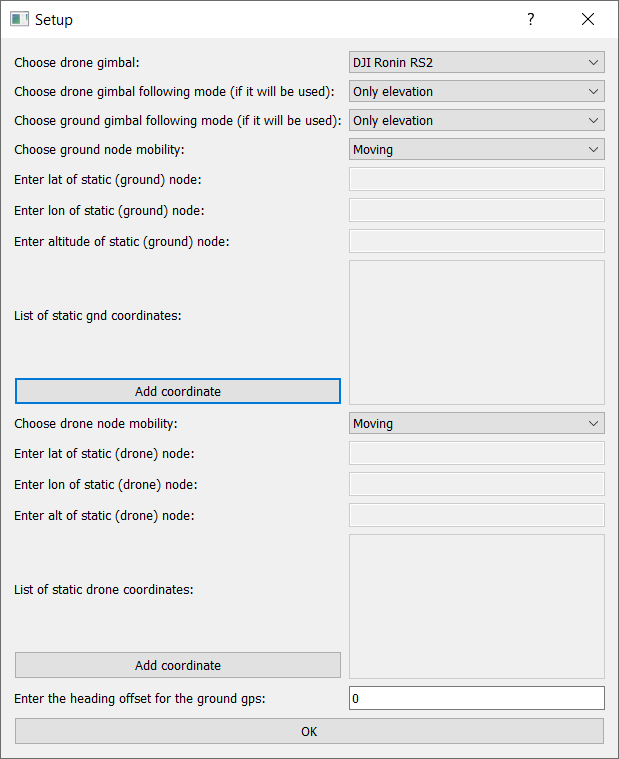
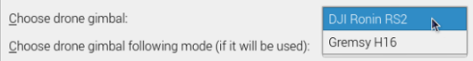
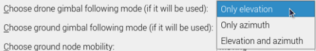
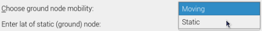

# Guide for using the GUI

## Initial recommendations
It is recommended to follow the guidelines in this section to start the operation of the air-to-ground channel sounder.

* Connect every component of the system as shown in the Figure of section [Block Diagram](MeasurementSystem.md#block-diagram).

* Turn on both host computers (Manifold and Rasberry Pi).
* Manually check each component connection, by following what is explained in sections [Gimbal to Host Connection](MeasurementSystem.md#gimbalrs2-to-host-connection), [GPS to Host Connection](MeasurementSystem.md#gps-to-host-connection), [RFSoC to Host Connection](MeasurementSystem.md#rfsoc-to-host-connection), [Host Wifi to Router Connection](MeasurementSystem.md#host-wifi-to-router-connection), [RFSoC to Host Ethernet Connection](MeasurementSystem.md#ethernet-rfsoc-to-host-connection). The software will check which devices are physically connected to the host, but is better to do a double check.
* If an error is encountered check some common problems in section [Troubleshooting](Troubleshooting.md).

## Definitions

For the sake of clarity, we redefine some words that are being used in this document.

* **Measurement**: comprises the channel sounding process *from* the moment the user presses the ``START`` button *until* ``STOP`` is pressed.
* **Experiment**: comprises the channel sounding process *from* the moment the user presses the ``START`` button *until*  ``FINISH`` is pressed. 

## Operation

After opening the A2GMeasurements GUI, the first window that will appear is shown in the following Figure:

<figure markdown="span">
  { width="400" }
  <figcaption>First window after A2GMeasurements GUI is opened</figcaption>
</figure>

Press the ``Setup`` menu:

<figure markdown="span">
  { width="400" }
  <figcaption>Setup menu opened</figcaption>
</figure>

Then press ``Setup devices and more``:

<figure markdown="span">
  { width="400" }
  <figcaption>Setup devices and more</figcaption>
</figure>

After that, a Setup window as shown in the following Figure  will appear:

<figure markdown="span">
  { width="400" }
  <figcaption>Setup window for configuring some parameters</figcaption>
</figure>

Choose the drone gimbal from the available options:

<figure markdown="span">
  { width="400" }
  <figcaption>Drone gimbal selection</figcaption>
</figure>

NOTE: *the Gremsy H16 gimbal option is available but the behaviour of the gimbal is not optimal*.

Choose along which of its own axis, drone's gimbal should follow ground node movement:

<figure markdown="span">
  { width="400" }
  <figcaption>drone's gimbal axis following ground node</figcaption>
</figure>

Choose along which of its own axis, ground's gimbal should follow drone node movement:

<figure markdown="span">
  { width="400" }
  <figcaption>ground's gimbal axis following drone node</figcaption>
</figure>

Choose ground node mobility:

<figure markdown="span">
  { width="400" }
  <figcaption>ground node mobility</figcaption>
</figure>

If ground node's mobility was ``Static``, the following text boxes will become active. Enter there the coordinates (in decimal degrees) of the ground node:

<figure markdown="span">
  { width="400" }
  <figcaption>static coordinates for ground node</figcaption>
</figure>

Choose drone node mobility:

<figure markdown="span">
  { width="400" }
  <figcaption>drone node mobility</figcaption>
</figure>

If drone node's mobility was ``Static``, the following text boxes will become active. Enter there, the coordinates (in decimal degrees) of the drone node:

<figure markdown="span">
  { width="400" }
  <figcaption>static coordinates for drone node</figcaption>
</figure>

If there is mismatch between the front of the ground gimbal and the GPS attitude baseline (see section [Components](MeasurementSystem.md#components)), enter in the following text box the offset (in degrees). The offset angle is measured as described in the API html in ``GpsSignaling()`` and ``GpsSignaling.setHeadingOffset()``:

<figure markdown="span">
  { width="400" }
  <figcaption>ground node attitude offset for the baseline between gps antennas</figcaption>
</figure>

Finally, press ``OK``:

<figure markdown="span">
  { width="400" }
  <figcaption>press OK</figcaption>
</figure>

After pressing ``OK``, the main window of the A2GMeasurements app will appear.

NOTE: the parameters configured in the Setup window (see [Setup Window](assets/a2gmeas_setup_win_4.png)) are not modifiable until the user presses ``Disconnect drone``. After that, the menu ``Setup devices and more`` will be available again.