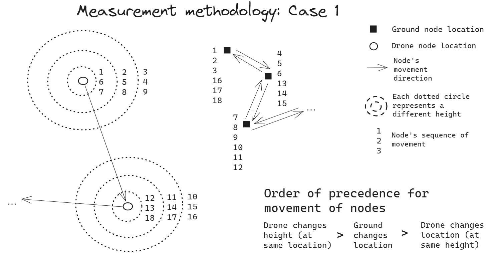

# Goal of the methodology

The purpose of this section is to define the main actors involved in a measurement process with their respective actions. The output of the measurement methodology is a detailed **schedule** where each actor performs its actions in a synchronized or orchestatred manner. This means that there will be actions that can be performed simultaneously (by different actors) and others that not. In what follows, these details are explained.

# Actors and actions

In the measurement process the following main actors are identified:

- Drone operator: responsible for controlling the drone
- Software operator: responsible for managing the a2gMeasurements software
- Vehicle operator/Driver: responsible for moving the vehicle where the ground node is located

Each actor can perform a defined set of actions.

## Drone operator

As for the drone operator, the actions he can perform are:

- `Move the drone`: the drone moves from one location to another one, maintaining the same height
- `Hover the drone`: the drone hovers at its current position
- `Change height`: the drone changes its height, maintaining the same location

Notice that in the "Move the drone" action are included taking off and landing the drone, since they imply a movement from one location (ground to air or last point to ground) to another.

## Software operator

The software operator can perform the following actions:

- `Start RF`: starts the thread responsible for making the TX start to send power, and the RX to listening for incoming power
- `Stop RF`: stops the thread of the RX responsible for listening for incoming power
- `Rotate the ground gimbal`: rotates the ground gimbal by a given attitude (yaw, pitch)
- `Rotate the drone gimbal`: rotates the drone gimbal by a given attitude (yaw, pitch)

## Vehicle operator

The "vehicle operator"/drinver can perform the following actions:

- `Move the vehicle`: the vehicle is moved from one position to another
- `Stop the vehicle`: the vehicle rests at its current position

It is worth noting that some of these actions can be/would be performed automatically (without the intervention of the respective human operator), but in the **schedule** they are still classified as performed by their respective operator (wheter it is human or automated software) for the convenience of seeing who is responsible of each action to be executed in the measurement process.

# Simultaneous actions

There are some actions that can be performed simultaneously by different actors (i.e. drone operator `Hover the drone` while the software operator `Start RF`). Also, while an actor is performing only one action (i.e. `Hover the drone`) another operator can perform multiple actions in a predefined priority order (i.e. `Move drone gimbal` -> `Move ground gimbal` -> `Start RF`).

Therefore, a list of each Group of Ordered and Simulatenous Actions (GOSA) performed by different operators is detailed as follows:

## Group A

- Action: `Stop the vehicle`. Actor: Vehicle operator
- Action: `Hover the drone`. Actor: Drone operator
- Action: `Move the drone gimbal`. Actor: Software operator
- Action: `Move the gnd gimbal`. Actor: Software operator
- Action: `Start RF`. Actor: Software operator
- Action: `Stop RF`. Actor: Software operator

## Group B

- Action: `Move the drone`. Actor: Drone operator

## Group C

- Action: `Move the vehicle`. Actor: Vehicle operator

# Types of measurements

In a measurement campaing there are multiple degrees of freedom, meaning ways in which the measurement can be conducted.

These degrees of freedom arise from:

1. Different types of movements from the nodes
2. Different types of rotation movements from the gimbals
3. Different schemas to start, pause, resume and end an RF link while nodes are moving.

## Schema used for gimbal actions and start and stop RF actions

There are different ways in which we can enforce the rotation of the gimbals (i.e. make a 360 degrees rotation, point an specific sector of angles, point to a specific angle, etc.), and equivalently, different ways in which we can start and stop an RF link (i.e. leave the RF link alive all the time, stop the RF link while the nodes are moving, etc.).

However, the decided schema for the gimbal actions is:

- Once the node is not moving (has reached its next destination or height), the drone gimbal will point towards the ground node (in both yaw and pitch)
- Once the node is not moving (has reached its next destination), the ground gimbal will point towards the drone node (in both yaw and pitch)

The decided schema for the start and stop RF actions is:

- Once the node is not moving (has reached its next destination or height), a `Start RF` action will be triggered for a specified duration time (configurable before the measurement campaign starts). The `Stop RF` action will be triggered once the specified duration time has passed.
- No `Start RF` or `Stop RF` action will be triggered when the nodes are moving.

## Schema for orchestrated movement of both nodes

There are only 3 possible movements the nodes can make:

- Drone changes location
- Drone changes height
- Ground changes location

To properly plan the measurement campaign we have to define an **order of precedence** for the orchestrated movement of the nodes. In the following sections
we show the possible cases for the **order of precedence** of node movements.

### Case 1

For this case the order of precedence is:

- Drone changes its height first
- Ground changes its location then
- Drone changes its location then

The previous order is represented in the following diagram, for an example in which the drone will visit 3 different heights, the ground will visit 3 different locations, and the drone will visit 2 different locations. However, the same measurement methodology applies **regardless** of the number of heights, ground locations and drone locations.

<figure markdown="span">
  { width="400" }
  <figcaption>Measurement methodology for the Case 1 of the order of precedence for node movements </figcaption>
</figure>
