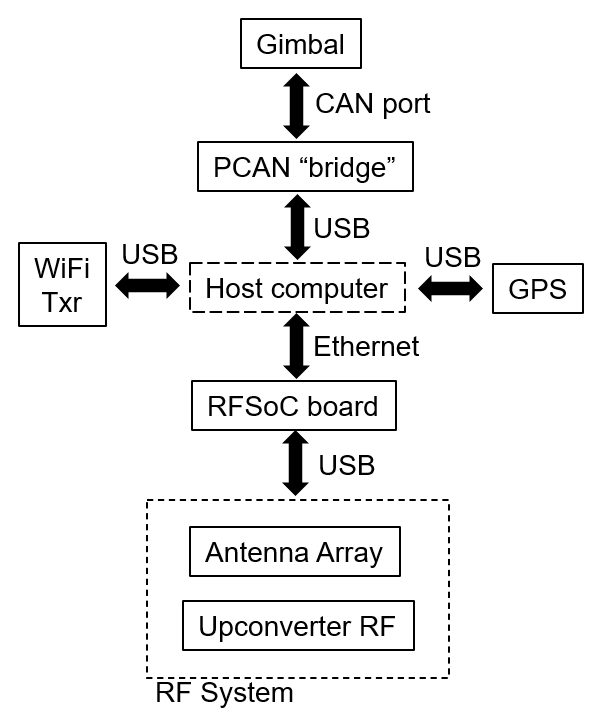
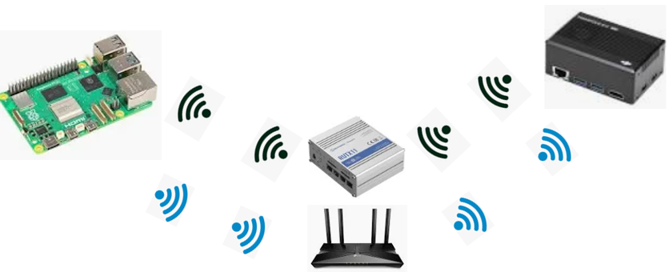
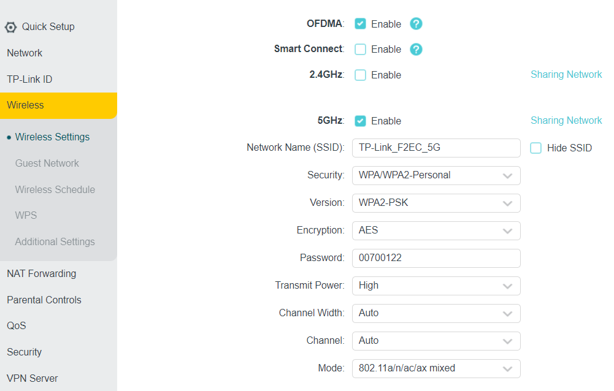
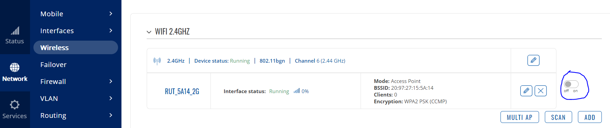
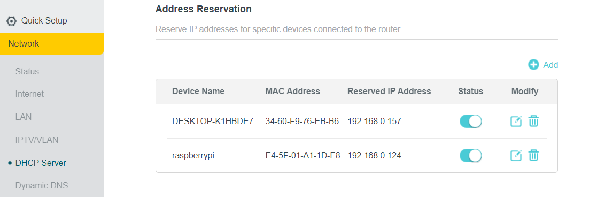
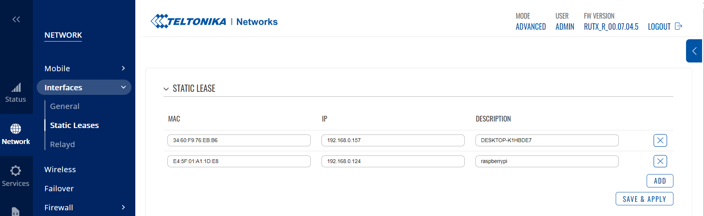

# Measurement system

## Block diagram

The system is composed by two nodes (the ground node and the air/drone node) that communicate with each other through IEEE 802.11 ac.

Each node contains a set of devices connected to it, and managed by a host computer. A diagram of the devices connected to each node is shown in the following Figure.

<figure markdown="span">
  { width="400" }
  <figcaption>Host computer and devices connected to it for each node</figcaption>
</figure>

The specific devices used for each of the components in the previous Figure are shown in the next Table.

<div class="center-table" markdown>
| Type device | Device used                          |
| :---------: | :----------------------------------: |
| Host computer (ground)     | Raspberry Pi 4B  |
| Host computer (air)     | DJI Manifold 2-C |
| Gimbal    | DJI Ronin RS2 |
| PCAN "bridge" | DJI Ronin Focus Wheel + PEAK system PCAN-USB |
| GPS | Septentrio mosaic-go heading evaluation kit |
| RFSoC board | Xilinx RFSoC 2 x 2 Kit |
| WiFi Txr (ground) | Raspberry Pi 4B integrated IEEE 802.11ac |
| WiFi Txr (air) | TP Link Archer T4U |
| RF System | Sivers EVK06002 + Sivers TRX BF/01 RFIC |
</div>

In addition to the mentioned devices, we use a router (TP-Link AX1500 or RUTX11) as an access point for both nodes. The router is already configured to assign specific static addresses to each node.

## Software

### Files

The main files where most of the system functionality is implemented are:

- `a2gmeasurements.py`: this file has all the functionality related with operating, controlling and collecting information from the devices. It comprises the classes `GimbalRS2`, `GpsSignaling`, `myAnritsuSpectrumAnalyzer`, `HelperA2GMeasurements`, `GimbalGremsyH16`, `SBUSEncoder` and `RFSoCRemoteControlFromHost` among others. See the available API in [API Reference Gimbal](GimbalRS2.md), [API Reference GPS](GpsSignaling.md), [API Reference RFSoC](RFSoCHandler.md), [API Reference Communication](NodesCommunication.md).

- `GUI_A2G_MEAS.py`: this file has all the functionality related with the Graphical User Interface (GUI). It calls methods from `a2gmeasurements.py` to manipulate the devices by using the GUI.

- `drone_main.py`: this is a script that setup the devices and the wireless connection at the air node.

- `a2gUtils.py`: this file contains few auxiliary (general purpose) methods that are used by other files previously mentioned. It is required for both nodes. If the developer wants to follow the file structure already used, they can extend this file by adding any auxiliary or general purpose functionality that is not specifically related to the devices used, i.e. some type of mathematical computation, memory management, etc.

- `docs/`: this folder contains the documentation for this project.

The files `a2gmeasurements.py` and `a2gUtils.py` must be placed in the working directories of each node's host computer.

The file `GUI_A2G_MEAS.py` is only required to be placed in the working directory of the ground node's host computer.

The file `drone_main.py` is only required to be placed in the working directory of the air node's host computer.

## GimbalRS2 to host connection

Connect the CAN port of the gimbal RS2 to any USB port of the host computer, using the DJI Ronin Focus Wheel and the PEAK System PCAN-USB bridge, as indicated in the following Figure.

<figure markdown="span">
  { width="400" }
  <figcaption>Connection between the gimbal RS2 and the host</figcaption>
</figure>

## GPS to host connection

Connect the USB port from the Septentrio gps to any USB port of the host computer, as indicated in Figure.

<figure markdown="span">
  { width="400" }
  <figcaption>Connection between the GPS and the host</figcaption>
</figure>

**DO NOT** use the port named `REC-USB` of the Septentrio gps.

## RFSoC to host connection

Connect any of the RFSoC Ethernet ports to any of the Ethernet ports of the host computer, as indicated in the following Figure.

<figure markdown="span">
  { width="400" }
  <figcaption>Connection between the RFSoC and the host</figcaption>
</figure>

Since each node uses both the Ethernet port (to communicate with each RFSoC) and the WiFi (to communicate with the other node), the host computer should be configured so that it supports both types of communication simultaneously. 

Additionally, we configure the Ethernet network (composed by a host computer and an RFSoC) to have static IP addresses different from the WiFi network.

### Windows

!!! success "Note"
    ```
    The following instructions have already been set up for the Manifold.
    ```

In Windows, follow these steps to make the host computer communicate through both Ethernet and WiFi:

* In the Control Panel open the `Network and Sharing Center`
* Click on `Change adapter settings`
* Right-click on the Ethernet adpater icon and choose `Properties`. (You have to repeat this process for the WiFi adapter as well)
* Click on the `Configure` button, under the `Network` tab
* Click on the `Advanced` tab
* From the left choices, select `Priority and VLAN`
* From the right drop-down menu, select `Priority and VLAN disabled`
* Press `Ok`


These additional steps are required to finish the configuration:

* Open a PowerShell window
* Type `Add-WindowsCapability -Online -Name OpenSSH.Server~~~~0.0.1.0`
* Type `Start-Service sshd`
* Type `Get-Service sshd`
* Type `Set-Service -Name sshd -StartupType 'Automatic'`

### RaspbianOS

!!! success "Note"
    ```
    The following instructions have already been set up for the Raspberry Pi 4B 64 bits.
    ```

Follow these steps:

* Open the `/etc/dhcpd.conf` file
* Go to the end of the file
* In a newline write `interface eth0`
* In a newline write `static ip_address=10.1.1.50/24`
* In a newline write `static routers=10.1.1.1`
* In a newline write `static domain_name_servers=10.1.1.1`


## Host WiFi to router connection 

In order to have a communication between the two nodes, each host computer (Manifold, Raspberry) will connect to the same router wirelessly. The router will act as a centralized device automatically handling any message exchange between both hosts, as illustrated below:

<figure markdown="span">
  { width="400" }
  <figcaption>Communication between nodes made through router. Either of the shown routers will be used (not both)</figcaption>
</figure>

At the moment this documentation was written, the following router settings are available:

<div class="center-table" markdown>
| Property | TP-LINK| RUTX11 |
| :------------: | :--------------------: | :----------------: |
| URL (router configuration)     | `192.168.0.1`  | `192.168.0.10` |
| Username (router configuration)     |  | admin |
| Password (router configuration)    | jvvtt2937 | Jvvtt2937 |
| SSID (5GHz) | TP-Link_F2EC_5G | RUT_5A15_5G |
| Password (SSID) | 00700122 | n1GYa3u7 |
</div>

To guarantee that the connection between each of the host computers (Manifold and Raspberry or their replacements) to the router is done through the 5GHz network, only the 5GHz band is enabled in the router configuration website.

The following pictures show how to disable the 2GHz network for the routers available at the moment this documentation was written:

<figure markdown="span">
  { width="400" }
  <figcaption>Disable 2GHz wireless network on TPLink</figcaption>
</figure>

<figure markdown="span">
  { width="400" }
  <figcaption>Disable 2GHz wireless network on RUTX11</figcaption>
</figure>

In order to automatize the connections between both host computers, the chosen router has been configured so that the IP addressing of the DHCP server assigns always the same IP address to the host computers (Manifold and Raspberry) identified by their MAC addresses. 

The address assignment by the DHCP server is shown in the following table:

<div class="center-table" markdown>
| MAC Address | Static IP address asigned | 
| :------------: | :--------------------: | 
| 34-60-F9-76-EB-B6 (Manifold) | `192.168.0.157`  | 
| E4-5F-01-A1-1D-E8 (Raspberry Pi 4B 64bits) | `192.168.0.124`
</div>

Such address reservation is configured in the available routers as shown below:

<figure markdown="span">
  { width="400" }
  <figcaption>Address reservation on TPLink</figcaption>
</figure>

<figure markdown="span">
  { width="400" }
  <figcaption>Address reservation on RUTX11</figcaption>
</figure>

!!! success "Multiple routers at the same time"
    ```
    Both routers have configured to have the same address range (`192.168.0.100` - `192.168.0.249`), so if for any reason they have to be used simultaneously, the address range should be exclusive for each router.
    ```

## Ethernet RFSoC to host connection

Open a terminal or command line in the host computer. Type the following command:

!!! warning "Connect to RFSoC"
    ```sh
    ssh xilinx@10.1.1.30
    ```

When asked for password, type:

!!! warning "Enter password"
    ```sh
    xilinx
    ```

This will allow you to use the command line of the RFSoC from the host computer.
