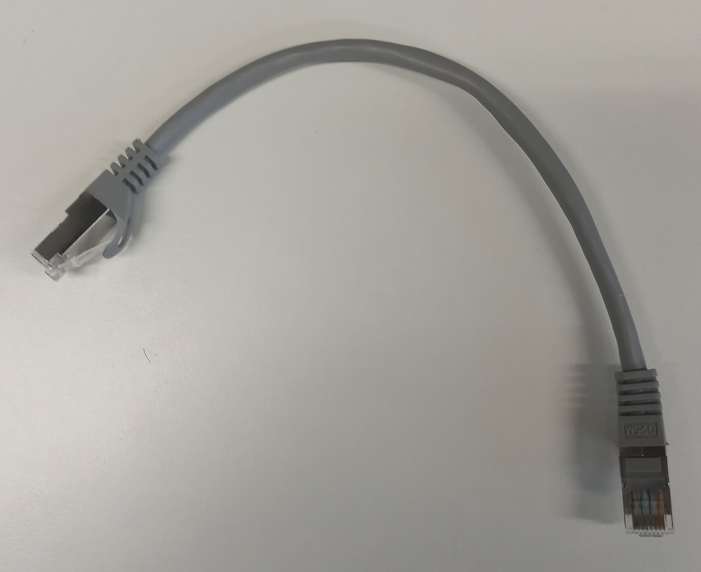

# Components

The node represented by the block diagram in [Measurement system](MeasurementSystem.md#block-diagram) is all bundled in a 3D printed case. The following picture show the 3D printed case with all the components connected for the drone node.

<figure markdown="span">
  { width="400" }
  <figcaption>Real look of a node of the measurement system</figcaption>
</figure>

## Drone node

### Case

<figure markdown="span">
  { width="400" }
  <figcaption>Top view of the case with its 3 slots to place the cards with the devices attached to them</figcaption>
</figure>

<figure markdown="span">
  { width="400" }
  <figcaption>Front view of the 3d printed case</figcaption>
</figure>

### Voltage regulator

<figure markdown="span">
  { width="400" }
  <figcaption>Voltage regulator + cable in + cable out</figcaption>
</figure>

### Slot card with voltage regulators

<figure markdown="span">
  { width="400" }
  <figcaption>Slot card with voltage regulators</figcaption>
</figure>

### Power Distribution Unit

<figure markdown="span">
  { width="400" }
  <figcaption>DJI Power Distribution Unit (PDU) + cable</figcaption>
</figure>

### Slot card with host computer

<figure markdown="span">
  { width="400" }
  <figcaption>Slot card with Manifold + DJI USB Hub + PCAN bridge + cables</figcaption>
</figure>

### Ethernet cable

<figure markdown="span">
  { width="400" }
  <figcaption>Ethernet cable (connecting RFSoC and Manifold)</figcaption>
</figure>

### PCAN device

<figure markdown="span">
  { width="400" }
  <figcaption>PCAN bridge</figcaption>
</figure>

### PDU cable

<figure markdown="span">
  { width="400" }
  <figcaption>DJI cable to power the Manifold from the PDU</figcaption>
</figure>

### USB Hub

<figure markdown="span">
  { width="400" }
  <figcaption>DJI USB Hub</figcaption>
</figure>

### Host computer

<figure markdown="span">
  { width="400" }
  <figcaption>DJI Manifold 2C computer</figcaption>
</figure>

### WiFi adapter

<figure markdown="span">
  { width="400" }
  <figcaption>TP-LINK Archer T4U WiFi Adapter</figcaption>
</figure>

### ADC Wideband balun board and cables

<figure markdown="span">
  { width="400" }
  <figcaption>Texas Instruments (TI) ADC Wideband Balun Board (ADC-WB-BB) + RF cables to ADC and to antenna frontend + 3D printed protection case</figcaption>
</figure>

### ADC-to-board RF cable

<figure markdown="span">
  { width="400" }
  <figcaption>RF cable connecting RFSoC ADC and the ADC-WB-BB + balun</figcaption>
</figure>

### Board-to-antenna-frontend RF cable

<figure markdown="span">
  { width="400" }
  <figcaption>RF cable connecting the ADC-WB-BB and the antenna frontend</figcaption>
</figure>

### ADC Wideband balun board

<figure markdown="span">
  { width="400" }
  <figcaption>TI ADC-WB-BB</figcaption>
</figure>

### Slot card with RFSoC

<figure markdown="span">
  { width="400" }
  <figcaption>Xilinx RFSoC 2x2 + slot card + power cable</figcaption>
</figure>

### Antenna frontend

<figure markdown="span">
  { width="400" }
  <figcaption>Sivers EVM (antenna frontend)</figcaption>
</figure>

### Gimbal payload adapter

<figure markdown="span">
  { width="400" }
  <figcaption>DJI Gimbal RS2 metallic adapter to place payload + 3D printed block</figcaption>
</figure>

### Gimbal

<figure markdown="span">
  { width="400" }
  <figcaption>DJI Gimbal RS2 + Tilta adapter to power it</figcaption>
</figure>

### Adapter 1

<figure markdown="span">
  { width="400" }
  <figcaption>Red metallic ring adapter which (in conjuction with the black metallic adapter) matches the Gimbal RS2 to the DJI M600 drone</figcaption>
</figure>

### Adapter 2

<figure markdown="span">
  { width="400" }
  <figcaption>Black metallic adapter which (in conjuction with the red metallic adapter) matches the Gimbal RS2 to the DJI M600 drone</figcaption>
</figure>

### 6S LiPo battery cable

<figure markdown="span">
  { width="400" }
  <figcaption>Cable connecting the 6S LiPo battery to the PDU</figcaption>
</figure>

### 4S LiPo battery cable

<figure markdown="span">
  { width="400" }
  <figcaption>Cable connecting the 4S LiPo battery to voltage regulators</figcaption>
</figure>

## Weight of the components

The following table shows the weight of each component listed in previously shown pictures, plus the weight of other components.

Click on each row (under the column "Component") to see a picture of the component that was weighted.

|                 Component                    |  Weight (g)  |
| :------------------------------------------: | :----------: |
| [Voltage regulator](NodeComponents.md#voltage-regulator)     | 78 |
| [Slot card with voltage regulators](NodeComponents.md#slot-card-with-voltage-regulators) | 298 |
| [PDU + cable](NodeComponents.md#power-distribution-unit) | 58 |
| [Slot card with Manifold](NodeComponents.md#slot-card-with-host-computer) | 466 |
| [Ethernet cable](NodeComponents.md#ethernet-cable) | 16 |
| [PCAN device + cable](NodeComponents.md#pcan-device) | 106 |
| [PDU cable](NodeComponents.md#pdu-cable) | 12 |
| [USB Hub](NodeComponents.md#usb-hub) | 58 |
| [Host computer](NodeComponents.md#host-computer) | 200 |
| [WiFi adapter](NodeComponents.md#wifi-adapter) | 28 |
| [ADC board and cables](NodeComponents.md#adc-wideband-balun-board-and-cables) | 130 |
| [ADC to TI board RF cable](NodeComponents.md#adc-to-board-rf-cable) | 22 |
| [TI board to antenna frontend RF cable](NodeComponents.md#board-to-antenna-frontend-rf-cable) | 8 |
| [TI board](NodeComponents.md#adc-wideband-balun-board) | 12 |
| [Slot card with RFSoC](NodeComponents.md#slot-card-with-rfsoc) | 310 |
| [Antenna frontend](NodeComponents.md#antenna-frontend) | 246 |
| [Gimbal payload adapter](NodeComponents.md#gimbal-payload-adapter) | 120 |
| [3D printed case](NodeComponents.md#case) | 402 |
| [Gimbal](NodeComponents.md#gimbal) | 1346 |
| [Red metallic ring adapter](NodeComponents.md#adapter-1) | 22 |
| [Black Tilta adapter](NodeComponents.md#adapter-2) | 394 |
| [6S battery cable](NodeComponents.md#6s-lipo-battery-cable) | 46 |
| [4S battery cable](NodeComponents.md#4s-lipo-battery-cable) | 54 |
| Drone tag | 18 |
| 6S LiPo battery  | 776 |
| 4S LiPo battery  | 466 |
| SmallRig battery |  560 |

