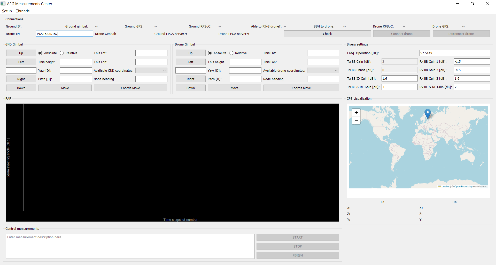

# Main window

Following Figure shows the main window where the user controls the different devices:

<figure markdown="span">
  { width="400" }
  <figcaption>Main window of the A2GMeasurements app</figcaption>
</figure>

The enumerated panels of the main window are:

1. Check connections panel (section [Check connections](PanelsGUI.md#check-connections-panel))
2. Ground gimbal control panel (section [Ground gimbal](PanelsGUI.md#ground-gimbal-panel))
3. Drone gimbal control panel (section [Drone gimbal](PanelsGUI.md#drone-gimbal-panel))
4. Sivers settings configuration panel (section [Sivers settings](PanelsGUI.md#sivers-settings-panel))
5. Power Angular Profile visualization panel (section [Visualize PAP](PanelsGUI.md#power-angular-profile-panel))
6. GPS visualization panel (section [Visualize GPS](PanelsGUI.md#gps-visualization-panel))
7. Control measurements panel (section [Control measurements](PanelsGUI.md#control-measurements-panel))
8. Terminal panel (section [Terminal](PanelsGUI.md#terminal-panel))

## Check connections panel

This panel shows which of the devices of each node (ground and air) are connected to their respective host computers. The state for the connection between the device and the host computer could be ``False``, ``True`` or ``None``, and is assessed by the ``Check`` button. 

The ``None`` value is used when a connection could not be checked and so the state of the connection is not known. 

**A wireless connection won't be allowed (the Connect button will not be available) until the user presses the ``Check`` button a first time**.

The ``Connect`` button will be available for the user to establish a wireless connection between both nodes, *even if no devices are connected to either host computer*. However, no functionality will be available as no devices are detected by the host computers of each node. 

As a consequence of this, after the user sees the state of the connections under the ``Check connections`` Panel, any device that is not connected won't be available, and it is thus the choice of the user to press the ``Connect`` button immediately or review again the proper connections between the devices and their hosts and press the ``Connect`` button after the desired devices are connected to their host.

For implement changes to this behaviour of the GUI, see the section [Dev connections](InfoDevelopers.md#connections-handling).

## Ground gimbal panel

## Drone gimbal panel

## Sivers settings panel

It is not possible to change the Sivers settings during a measurement. To change Sivers settings, first stop a measurement by pressing ``STOP``, then press ``FINISH``, and then procede to change the Sivers settings.

## Power Angular Profile panel

The Power Angular Profile (PAP) is computed from the sensed Channel Impulse Response (CIR). The power of each and all delay bins is added to obtain the PAP. This is done for each of the beam angles.

The actual rate at which the PAP changes depends on the rate at which the channel changes. The visualization panel updates the displayed image each 100 ms, meaning that changes faster than 10 Hz will not be seen in the visualization panel.

## GPS visualization panel

## Control measurements panel

## Terminal panel