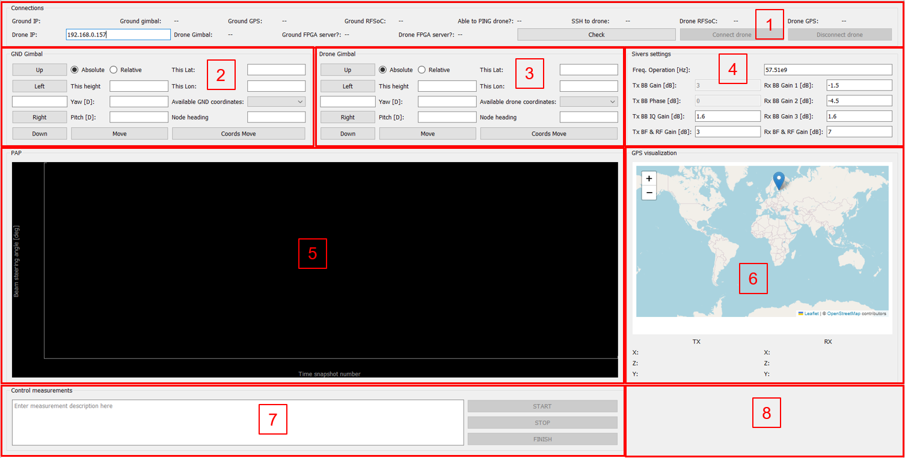

# Setup window
Here goes the setiup window.

# Main window

The following figure shows the main window where relevant information is displayed and user controls the available devices:

<figure markdown="span">
  { width="400" }
  <figcaption>Main window of the A2GMeasurements app</figcaption>
</figure>

The enumerated panels of the main window are:

1. Check connections panel (section [Check connections](PanelsGUI.md#check-connections-panel))
2. Ground gimbal control panel (section [Ground gimbal](PanelsGUI.md#ground-gimbal-panel))
3. Drone gimbal control panel (section [Drone gimbal](PanelsGUI.md#drone-gimbal-panel))
4. Sivers settings configuration panel (section [Sivers settings](PanelsGUI.md#sivers-settings-panel))
5. Power Angular Profile visualization panel (section [Visualize PAP](PanelsGUI.md#power-angular-profile-panel))
6. GPS visualization panel (section [Visualize GPS](PanelsGUI.md#gps-visualization-panel))
7. Control measurements panel (section [Control measurements](PanelsGUI.md#control-measurements-panel))
8. Terminal panel (section [Terminal](PanelsGUI.md#terminal-panel))

## Check connections panel

This panel shows which of the devices of each node (ground and air) are connected to their respective host computers. The state for the connection between the device and the host computer could be ``False``, ``True`` or ``None``, and is assessed by the ``Check`` button. 

The ``None`` value is used when a connection could not be checked and so the state of the connection is not known. 

**A wireless connection won't be allowed (the Connect button will not be available) until the user presses the ``Check`` button a first time**.

The ``Connect`` button will be available for the user to establish a wireless connection between both nodes, *even if no devices are connected to either host computer*. However in that particular case, no functionality will be available as no devices are detected by the host computers of each node. 

As a consequence of this, after the user sees the state of the connections under the ``Check connections`` Panel, any device that is not connected won't be available, and it is thus the choice of the user to press the ``Connect`` button immediately or review again the proper connections between the devices and their hosts and press the ``Connect`` button after the desired devices are connected to their host.

For implement changes to this behaviour of the GUI, see the section [Dev connections](InfoDevelopers.md#connections-handling).

## Ground gimbal panel / Drone gimbal panel

The panels for the ground gimbal and the drone gimbal are identical if the Ronin RS2 was chosen for the drone node in the [Setup Window](PanelsGUI.md#setup-window). We will assume that is the case (the case when the user choose the Gremsy H16 gimbal is shown later in this section).

In the next subsections the components of the panel are shown.

### Joystick

The components shown in the figure below allow the user to control the gimbal by moving it with respect to its current value. 

<figure markdown="span">
  { width="400" }
  <figcaption>Control the gimbal with this buttons as a joystick</figcaption>
</figure>

The textbox is used so that the user can input the amount by which he wants to move the gimbal in the chosen direction. For example, if the user enters the value `56` and press the `Up` button, the gimbal will move `+56` degrees in pitch.

!!! success "Default value in textbox"
    If the user doesn't input any value in the textbox, the gimbal will move a default value of `10` degrees in the chosen direction.

!!! success "Range of values admitted"
  For the yaw, the range of values accepted lies between `-180` and `180`. For the pitch the maximum and minimum value will be determined by the gimbal configuration. However, when the gimbal has payload, it is recommended to not enter pitch values that potentially can make the gimbal stuck due to the payload size.

### Yaw, Pitch

The components shown in the figure below allow the user to control the gimbal by providing a yaw and pitch and a reference. 

<figure markdown="span">
  { width="400" }
  <figcaption>Control the gimbal by providing yaw, pitch and type of movement</figcaption>
</figure>

If `Absolute` radiobutton is chosen, the input values of yaw and pitch will be relative to reference of the gimbal (the 0 degrees direction of the gimbal, i.e. the heading of the gimbal).

If `Relative` radiobutton is chosen, the input values of yaw and pitch will be relative to last position of the gimbal.

Therefore, for example, if the use inputs `0` in the `Yaw` text box and `0` in the `Pitch` text box, the gimbal won't move if the `Relative` radiobutton is chosen, or it will move to the reference of the gimbal if the `Absolute` radiobutton is chosen.

### Available coordinates

The components in the figure below allow the user to move the gimbal to any of the coordinates that were input in the [Setup window](PanelsGUI.md#setup-window) for the corresponding node.

<figure markdown="span">
  { width="400" }
  <figcaption>Control the gimbal by chhosing among the coordinates entered in the Setup Window</figcaption>
</figure>

The user has to be provide in the texbox `Node heading` which is the heading of the gimbal (the direction of the reference of the gimbal). The admitted values are in the range `0-359`, with `0` being the case when the reference of the gimbal is pointing to the North.

### Input coordinates

The componentes in the figure below allow the user to move the gimbal to a specified coordinate.

<figure markdown="span">
  { width="400" }
  <figcaption>Control the gimbal by providing latitude, longitude and height</figcaption>
</figure>

The user must provide the latitude and longitude in decimal degrees (i.e. `62.2541144` and `2.6842464`), the height in meters. It also has to provide the `Node heading` as explained in the previous subsection.

## Sivers settings panel

It is not possible to change the Sivers settings during a measurement. To change Sivers settings, first stop a measurement by pressing ``STOP``, then press ``FINISH``, and then procede to change the Sivers settings.

## Power Angular Profile panel

The Power Angular Profile (PAP) is computed from the sensed Channel Impulse Response (CIR). The power of each and all delay bins is added to obtain the PAP. This is done for each of the beam angles.

The actual rate at which the PAP changes depends on the rate at which the channel changes. The visualization panel updates the displayed image each 100 ms, meaning that changes faster than 10 Hz will not be seen in the visualization panel.

## GPS visualization panel

## Control measurements panel

## Terminal panel