# Quick Start

## Previous checks

### WiFi connection

If WiFi is going to be used, each host computer has to be connected to the chosen router. The names of the WiFi networks are shown in [WiFi Networks](MeasurementSystem.md#host-wifi-to-router-connection) for each of the available routers.

!!! success "Internet connection is NOT required"
    The router doesn't need to be connected to the internet, since it will only act as passing the messages between the two nodes. None of the nodes uses the internet for any task.

Make sure that each node is connected to the wifi network of the chosen router. 

In Windows when the connection is established, the status "Connected, No Internet" will appear under the connections menu. 

In RaspbianOS when the connection is established, the wireless symbol in the top bar won't be blinking and will be bold.

### RFSoC server running

Before using the GUI, the RFSoC server has to be running on each RFSoC. To check if that is the case, follow these steps:

* Open a terminal in the Raspberry Pi, or open a Command Prompt in Windows
* Write `ssh xilinx@10.1.1.30` (Raspberry) or `ssh xilinx@10.1.1.40` (Manifold)
* Enter the password (`xilinx`)
* Write `ps aux | grep mmwsdr`
* From the appearing results, there has to be 2 files: `server.py` and `run.sh`. If either non of these files appear or there is only one, continue to the next step, otherwise the check is fine and the RFSoC server is running in the host computer that is being checked.
* Set the current directory to the `mmwsdr` folder. 
* Run the `run.sh` file by writing `sudo ./run.sh`. If any password is required, the password is `xilinx`.

## Activate python environment

The python environment having all the required packages to run the software has to be activated. 

Activating the python environment in the Raspberry depends on how do you plan to execute the software. There are two ways:

Using the Command Prompt:

* Open a new terminal window
* Type `conda activate groundnode`. If typed correctly, the environment will change from `(base)` to `(groundnode)` in the terminal window

Using Visual Studio Code:

* Open Visual Studio Code
* By default it has been setup to use the correct python environment, but (if needed) to set it up, press the highlighted section of the bottom bar:

<figure markdown="span">
  { width="400" }
  <figcaption>Change python environment in Visual Studio Code</figcaption>
</figure>
  
* From the options that appear, choose the one that has the string `groundnode` on it

In the Manifold, follow these steps:

* Open a new Anaconda Prompt
* Write `conda activate uavCom`

## Run the software

For the Manifold:

* In the terminal where you have previously activate the python environment, set the current directory to the `a2gMeasurements` folder
* Write `python drone_main.py`
* When asked `GND IP addr is 192.168.0.124?` choose with the arrow keys `Yes` if that is the case or `No` otherwise and press `ENTER`. If not, you will have to enter the ground IP address *in the correct format* (i.e. `[0-255].[0-255].[0-255].[0-255]`)
* When asked `GPS at DRONE is going to be used?` choose accordingly and press `ENTER`. If `Yes`, then enter the heading offset of the baseline between the two antennas in the proper format (i.e. `[0-360]`). If there is no offset or only one antenna is used, write `0`
* When asked `Gimbal at DRONE is going to be used?` choose accordingly and press `ENTER`
* When asked `RFSoC at DRONE is going to be used?` choose accordingly but *DO NOT* press `ENTER` yet. First you need to run the software on the ground node (Raspberry). Down below, it will be highlighted when you can press `ENTER`, after you have follow some steps in the ground node (Raspberry)

For the Raspberry:

Choose how to execute the software: through the command line or by using a python IDE like Visual Studio Code (recommended as from there you will be able to modify, debug, source control, and run the software).

Ananconda Prompt:

* In the terminal where you have previously activate the python environment, set the current directory to the `a2gMeasurements` folder
* Type `python GUI_A2G_MEAS.py`

Visual Studio Code:

* Make sure the working directory on the left panel is `A2GMEASUREMENTS` or open it by clicking on `File` > `Open Folder` and then choose the `a2gMeasurements` folder from the browser window
* Click on `Run` > `Run Without Debugging`

* After opening the A2GMeasurements GUI, the first window that will appear is shown in the following Figure:

<figure markdown="span">
  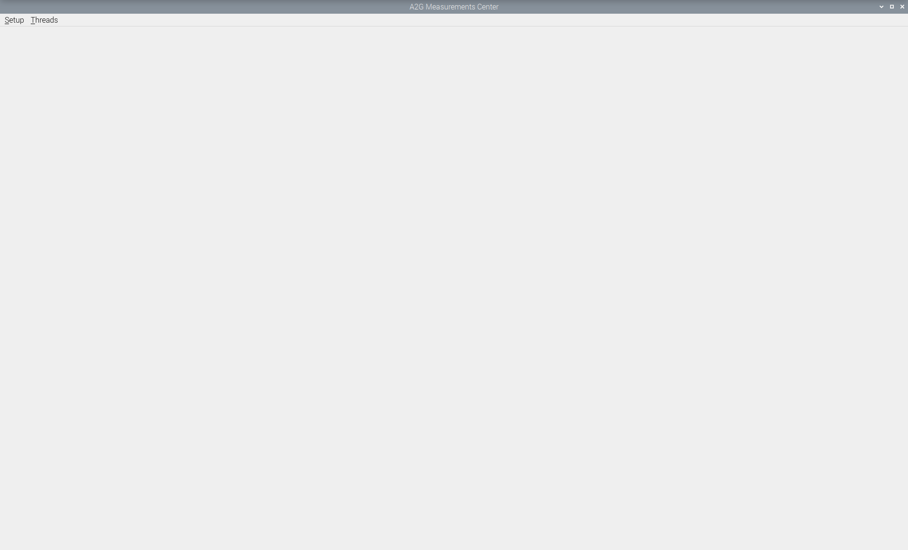{ width="400" }
  <figcaption>First window after A2GMeasurements GUI is opened</figcaption>
</figure>

* Press the ``Setup`` menu:

<figure markdown="span">
  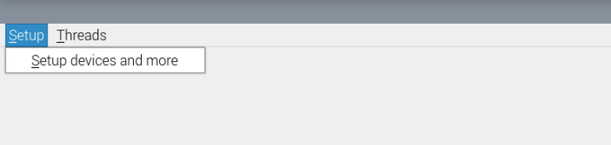{ width="400" }
  <figcaption>Setup menu opened</figcaption>
</figure>

* Then press ``Setup devices and more``:

<figure markdown="span">
  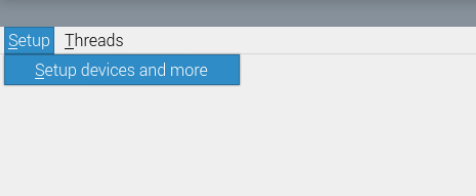{ width="400" }
  <figcaption>Setup devices and more</figcaption>
</figure>

* After that, a Setup window as shown in the following Figure  will appear:

<figure markdown="span">
  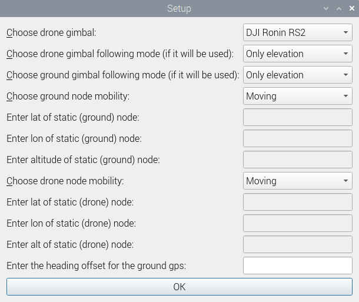{ width="400" }
  <figcaption>Setup window for configuring some parameters</figcaption>
</figure>

* Choose the drone gimbal from the available options:

<figure markdown="span">
  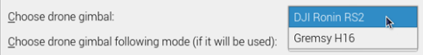{ width="400" }
  <figcaption>Drone gimbal selection</figcaption>
</figure>

NOTE: *the Gremsy H16 gimbal option is available but the behaviour of the gimbal is not optimal*.

* Choose along which of its own axis, drone's gimbal should follow ground node movement:

<figure markdown="span">
  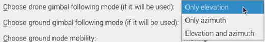{ width="400" }
  <figcaption>drone's gimbal axis following ground node</figcaption>
</figure>

* Choose along which of its own axis, ground's gimbal should follow drone node movement:

<figure markdown="span">
  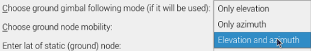{ width="400" }
  <figcaption>ground's gimbal axis following drone node</figcaption>
</figure>

* Choose ground node mobility:

<figure markdown="span">
  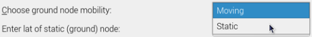{ width="400" }
  <figcaption>ground node mobility</figcaption>
</figure>

* If ground node's mobility was ``Static``, the following text boxes will become active. Enter there the coordinates (in decimal degrees) of the ground node:

<figure markdown="span">
  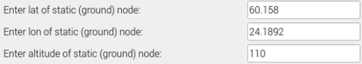{ width="400" }
  <figcaption>static coordinates for ground node</figcaption>
</figure>

* Choose drone node mobility:

<figure markdown="span">
  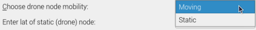{ width="400" }
  <figcaption>drone node mobility</figcaption>
</figure>

* If drone node's mobility was ``Static``, the following text boxes will become active. Enter there, the coordinates (in decimal degrees) of the drone node:

<figure markdown="span">
  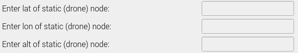{ width="400" }
  <figcaption>static coordinates for drone node</figcaption>
</figure>

* If there is mismatch between the front of the ground gimbal and the GPS attitude baseline (see section [Components](MeasurementSystem.md#components)), enter in the following text box the offset (in degrees). The offset angle is measured as described in the API html in ``GpsSignaling()`` and ``GpsSignaling.setHeadingOffset()``:

<figure markdown="span">
  { width="400" }
  <figcaption>ground node attitude offset for the baseline between gps antennas</figcaption>
</figure>

* Finally, press ``OK``:

<figure markdown="span">
  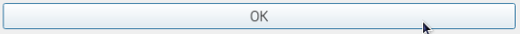{ width="400" }
  <figcaption>press OK</figcaption>
</figure>

* After pressing ``OK``, the main window of the A2GMeasurements app will appear.

!!! success "Setup window" 
    The parameters configured in the Setup window (see [Setup Window](assets/a2gmeas_setup_win_4.png)) are not modifiable until the user presses ``Disconnect drone``. After that, the menu ``Setup devices and more`` will be available again.