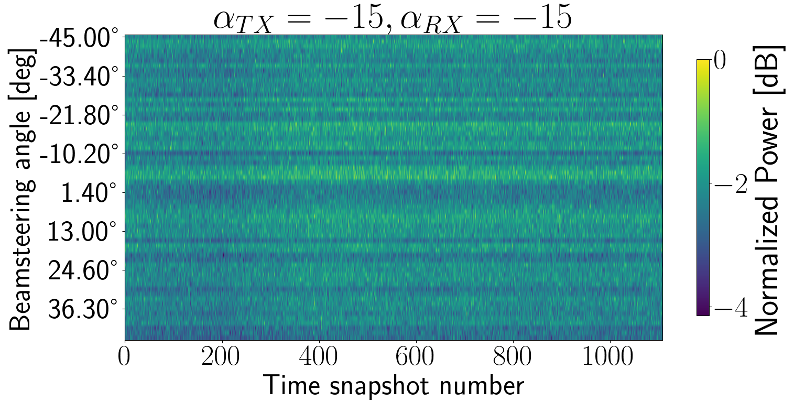

# Measurements Nivelles 2023

## Scenario with reflectors

Scenario of measurement performed at Nivelles (Belgium) on October 2023

<figure markdown="span">
  { width="400" }
  <figcaption>Scenario with multiple reflectors (cars, windows, walls) and transceivers separated by more than 30 m</figcaption>
</figure>

The RX was located in the vehicle on the right side of the figure (Ford Transit), the TX was located in the vehicle on the left side of the figure (Peugeot). Each node had a gimbal that was mechanically steered to a desired angle. Both gimbals were rotated only in their yaw axis. We denote $\alpha_{TX}$ , the yaw angle of rotation of the gimbal at the TX. Equivalently, we denote $\alpha_{RX}$ , the yaw angle of rotation of the gimbal at the RX.

The heights for the TX antenna and RX antenna were, 42.5cm and 52 cm, respectively.

The coordinates for the TX node were: 50.58641, 4.35453

The coordinates for the RX node were: 50.58669, 4.35454

### Results

Below are shown the Power Angular Profiles over time for the measurements done with the scenario described above, when both gimbal yaw angles were moved to specified values.

<figure markdown="span">
  { width="400" }
  <figcaption>Power Angular Profile over time for $\alpha_{TX} = 0$ deg,  $\alpha_{RX} = 0$ deg, with transceiver separation of 31.9 m</figcaption>
</figure>

<figure markdown="span">
  { width="400" }
  <figcaption>Power Angular Profile over time for $\alpha_{TX} = 0$ deg,  $\alpha_{RX} = -14$ deg, with transceiver separation of 31.9 m</figcaption>
</figure>

<figure markdown="span">
  { width="400" }
  <figcaption>Power Angular Profile over time for $\alpha_{TX} = 0$ deg,  $\alpha_{RX} = -31$ deg, with transceiver separation of 31.9 m</figcaption>
</figure>

<figure markdown="span">
  { width="400" }
  <figcaption>Power Angular Profile over time for $\alpha_{TX} = 15$ deg,  $\alpha_{RX} = 0$ deg, with transceiver separation of 31.9 m</figcaption>
</figure>

<figure markdown="span">
  { width="400" }
  <figcaption>Power Angular Profile over time for $\alpha_{TX} = 30$ deg,  $\alpha_{RX} = 0$ deg, with transceiver separation of 31.9 m</figcaption>
</figure>

<figure markdown="span">
  { width="400" }
  <figcaption>Power Angular Profile over time for $\alpha_{TX} = -15$ deg,  $\alpha_{RX} = 0$ deg, with transceiver separation of 31.9 m</figcaption>
</figure>

<figure markdown="span">
  { width="400" }
  <figcaption>Power Angular Profile over time for $\alpha_{TX} = -15$ deg,  $\alpha_{RX} = -15$ deg, with transceiver separation of 31.9 m</figcaption>
</figure>

<figure markdown="span">
  { width="400" }
  <figcaption>Power Angular Profile over time for $\alpha_{TX} = -30$ deg,  $\alpha_{RX} = 0$ deg, with transceiver separation of 31.9 m</figcaption>
</figure>

## Open space scenario

In contrast to previous scenario, in this scenario there are NO reflectors close to the transceivers.

<figure markdown="span">
  { width="400" }
  <figcaption>Open space scenario with transceivers separated by less than 9 m</figcaption>
</figure>

### Results

<figure markdown="span">
  { width="400" }
  <figcaption>Power Angular Profile over time for $\alpha_{TX} = 0$ deg,  $\alpha_{RX} = 0$ deg, with transceiver separation of 1 m</figcaption>
</figure>

<figure markdown="span">
  { width="400" }
  <figcaption>Power Angular Profile over time for $\alpha_{TX} = 0$ deg,  $\alpha_{RX} = 0$ deg, with transceiver separation of 2.65 m</figcaption>
</figure>

<figure markdown="span">
  { width="400" }
  <figcaption>Power Angular Profile over time for $\alpha_{TX} = 0$ deg,  $\alpha_{RX} = 0$ deg, with transceiver separation of 9 m</figcaption>
</figure>

## Reproduce the figures

Execute the script named `script_extract_padps_v2v_niveless_oct_2023.py` to produce the figures in thes page.
